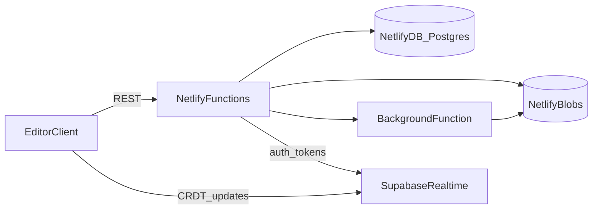

# Design Document: Backend API

## Overview

The Backend API provides persistence, authentication, export, and (stretch) collaboration for SVG Edit. It is designed to run on Netlify using Functions and Background Functions, with Netlify DB (Postgres) for relational data and Netlify Blobs for SVG assets and export artifacts.

Key design principles:

- **Netlify-native**: Use Netlify Functions, Background Functions, DB, and Blobs only.
- **API-first**: REST endpoints with OpenAPI documentation.
- **Separation of concerns**: HTTP layer, services, and data access are isolated.
- **Deterministic SVG validation**: Reuse `packages/core` parser/serializer for validation.
- **Observable**: Request IDs, structured logs, and metrics-ready logging.
- **Security-first**: JWT auth, RBAC, and rate limiting.

## Architecture

### High-Level Architecture



### Data Flow

1. Client sends REST requests to Netlify Functions.
2. Functions authorize requests, validate SVG with `packages/core`, and persist metadata in Netlify DB.
3. Large SVG payloads and export artifacts are stored in Netlify Blobs.
4. Export jobs are queued in DB and processed by Background Functions.
5. (Stretch) Realtime CRDT updates flow through Supabase Realtime channels.

### Module Organization

```
apps/backend/
├── src/
│   ├── app.ts               # Fastify app construction
│   ├── server.ts            # Local dev entry
│   ├── config.ts            # Env configuration
│   ├── routes/              # REST route registrations
│   ├── services/            # Business logic
│   ├── db/                  # DB access and migrations
│   └── storage/             # Netlify Blobs access
└── netlify/
    └── functions/
        └── api.ts           # Netlify Function handler
```

## Components and Interfaces

### API Layer

```typescript
interface ApiContext {
  requestId: string;
  userId?: string;
  roles: string[];
}

interface ApiError {
  code: string;
  message: string;
  details?: Record<string, unknown>;
}
```

### Auth Service

```typescript
interface AuthService {
  signup(email: string, password: string): Promise<User>;
  login(email: string, password: string): Promise<AuthTokens>;
  refresh(refreshToken: string): Promise<AuthTokens>;
  verifyAccessToken(token: string): Promise<AuthPrincipal>;
}
```

### Project & File Service

```typescript
interface ProjectService {
  list(userId: string): Promise<Project[]>;
  create(userId: string, input: CreateProjectInput): Promise<Project>;
  update(userId: string, projectId: string, input: UpdateProjectInput): Promise<Project>;
  delete(userId: string, projectId: string): Promise<void>;
}

interface FileService {
  get(projectId: string, fileId: string): Promise<ProjectFile>;
  create(projectId: string, input: CreateFileInput): Promise<ProjectFile>;
  update(projectId: string, fileId: string, input: UpdateFileInput): Promise<ProjectFile>;
  createRevision(fileId: string, svgText: string): Promise<FileRevision>;
}
```

### Export Service

```typescript
interface ExportService {
  enqueue(fileId: string, format: 'svg' | 'png'): Promise<ExportJob>;
  getStatus(jobId: string): Promise<ExportJob>;
  getResult(jobId: string): Promise<ExportResult>;
}
```

### Realtime (Stretch)

```typescript
interface RealtimeService {
  getChannelToken(projectId: string, userId: string): Promise<string>;
  publishPresence(projectId: string, payload: PresencePayload): Promise<void>;
}
```

## Data Models

```typescript
type Project = {
  id: string;
  ownerId: string;
  name: string;
  createdAt: string;
  updatedAt: string;
};

type ProjectFile = {
  id: string;
  projectId: string;
  name: string;
  blobKey: string;
  createdAt: string;
  updatedAt: string;
};

type FileRevision = {
  id: string;
  fileId: string;
  blobKey: string;
  createdAt: string;
};

type ExportJob = {
  id: string;
  fileId: string;
  format: 'svg' | 'png';
  status: 'queued' | 'running' | 'completed' | 'failed';
  resultBlobKey?: string;
  errorMessage?: string;
  createdAt: string;
  updatedAt: string;
};
```

## Correctness Properties

1. **Authorization boundary**: A user cannot access or mutate projects they do not own or share.
2. **Deterministic validation**: The same SVG input produces the same validation output using `packages/core`.
3. **Blob integrity**: DB records always reference existing blob keys.
4. **Revision immutability**: File revisions are append-only and never overwritten.
5. **Export determinism**: Re-exporting the same revision yields identical SVG output.
6. **Job idempotency**: Re-queuing the same export job returns the existing job if still active.
7. **Rate limit enforcement**: Requests exceeding limits receive consistent 429 responses.
8. **Audit logging**: All mutating actions create audit log entries.
9. **Background safety**: Export worker failures do not corrupt job state.
10. **Netlify compatibility**: No long-lived server processes or sockets in Functions.

## Error Handling

All API operations return structured errors with stable codes:

```typescript
type ApiError = {
  code: 'UNAUTHORIZED' | 'FORBIDDEN' | 'NOT_FOUND' | 'VALIDATION_FAILED' | 'RATE_LIMITED' | 'INTERNAL_ERROR';
  message: string;
  details?: Record<string, unknown>;
};
```

Errors are returned as JSON with consistent shape and an `x-request-id` header for correlation.

## Testing Strategy

- **Unit tests**: Services (auth, project/file, export) and validation functions.
- **Integration tests**: End-to-end API flows for auth + project CRUD + exports.
- **Contract tests**: OpenAPI schema validation for request/response payloads.
- **Load tests**: Basic API throughput checks against Netlify Function timeouts.
- **Security tests**: Password hashing, token validation, and RBAC checks.
