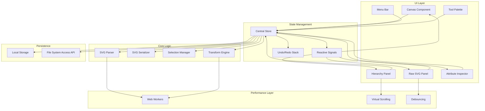

# Design Document: Frontend SVG Editor

## Overview

The Frontend SVG Editor is a web-based application built using Web Components and reactive signals for state management. The architecture emphasizes separation of concerns with distinct layers for UI components, state management, SVG manipulation, and performance optimization.

The editor provides four synchronized views of the SVG document:
1. **Visual Canvas** - Interactive rendering of the SVG
2. **Hierarchy Panel** - Tree view of the document structure
3. **Raw SVG Panel** - Text editor for direct markup editing
4. **Attribute Inspector** - Form-based attribute editing

All views are kept in sync through a centralized reactive state management system that propagates changes efficiently across the application.

## Architecture

### High-Level Architecture



### Component Architecture

The application follows a component-based architecture using Web Components:

1. **App Shell** (`<svg-editor-app>`)
   - Root component managing layout and theme
   - Coordinates panel resizing and layout persistence
   - Manages global keyboard shortcuts

2. **Canvas Component** (`<svg-canvas>`)
   - Renders SVG content using native SVG elements
   - Handles mouse/touch interactions for selection and manipulation
   - Provides visual feedback for drag operations

3. **Hierarchy Panel** (`<svg-hierarchy-panel>`)
   - Tree view of SVG document structure
   - Implements virtual scrolling for large documents
   - Supports expand/collapse and drag-to-reorder

4. **Raw SVG Panel** (`<svg-raw-panel>`)
   - Code editor with syntax highlighting
   - Debounced parsing to avoid excessive updates
   - Error highlighting and validation feedback

5. **Attribute Inspector** (`<svg-attribute-inspector>`)
   - Dynamic form generation based on selected element type
   - Type-specific input controls (color pickers, number inputs, etc.)
   - Real-time validation and error display

6. **Tool Palette** (`<svg-tool-palette>`)
   - Tool selection for creating primitives
   - Visual indication of active tool
   - Keyboard shortcut hints

7. **Menu Bar** (`<svg-menu-bar>`)
   - File operations (open, save, save-as)
   - Edit operations (undo, redo, copy, paste)
   - View options (theme toggle, panel visibility)

### State Management

The application uses a reactive signal-based state management system:

```typescript
interface EditorState {
  // Document state
  svgDocument: SVGElement | null;
  documentTree: DocumentNode[];
  rawSVG: string;
  
  // Selection state
  selectedIds: Set<string>;
  hoveredId: string | null;
  
  // UI state
  activeTool: Tool;
  theme: 'light' | 'dark';
  panelLayout: PanelLayout;
  
  // History state
  undoStack: Operation[];
  redoStack: Operation[];
  
  // Performance state
  isProcessing: boolean;
  progressPercent: number;
  
  // File state
  fileHandle: FileSystemFileHandle | null;
  isDirty: boolean;
}
```

Each property in the state is wrapped in a reactive signal that notifies subscribers when values change. Components subscribe to relevant signals and update their UI accordingly.

### Data Flow

1. **User Interaction** → Component captures event
2. **Action Dispatch** → Component dispatches action to store
3. **State Update** → Store updates relevant signals
4. **Signal Propagation** → All subscribed components receive updates
5. **UI Rendering** → Components re-render affected portions

This unidirectional data flow ensures predictable state updates and makes debugging easier.

## Components and Interfaces

### Core Interfaces

```typescript
// Document representation
interface DocumentNode {
  id: string;
  type: string;
  tagName: string;
  attributes: Map<string, string>;
  children: DocumentNode[];
  element: SVGElement;
}

// Operations for undo/redo
interface Operation {
  type: 'create' | 'delete' | 'move' | 'attribute' | 'batch';
  timestamp: number;
  undo: () => void;
  redo: () => void;
  description: string;
}

// Tool definitions
interface Tool {
  id: string;
  name: string;
  icon: string;
  cursor: string;
  onActivate: () => void;
  onDeactivate: () => void;
  onCanvasMouseDown: (event: MouseEvent) => void;
  onCanvasMouseMove: (event: MouseEvent) => void;
  onCanvasMouseUp: (event: MouseEvent) => void;
}

// Panel layout configuration
interface PanelLayout {
  hierarchyWidth: number;
  inspectorWidth: number;
  rawSVGHeight: number;
  hierarchyVisible: boolean;
  inspectorVisible: boolean;
  rawSVGVisible: boolean;
}
```

### SVG Parser

The SVG parser converts raw SVG text into a structured document tree:

```typescript
class SVGParser {
  parse(svgText: string): ParseResult {
    // 1. Use DOMParser to parse SVG text
    // 2. Validate the parsed document
    // 3. Build DocumentNode tree with unique IDs
    // 4. Return result with errors if any
  }
  
  parseInWorker(svgText: string): Promise<ParseResult> {
    // For large documents, offload parsing to Web Worker
  }
}

interface ParseResult {
  success: boolean;
  document: SVGElement | null;
  tree: DocumentNode[];
  errors: ParseError[];
}

interface ParseError {
  line: number;
  column: number;
  message: string;
  severity: 'error' | 'warning';
}
```

### SVG Serializer

The SVG serializer converts the document tree back to SVG text:

```typescript
class SVGSerializer {
  serialize(document: SVGElement): string {
    // 1. Clone the SVG element
    // 2. Clean up editor-specific attributes (IDs, classes)
    // 3. Format with proper indentation
    // 4. Return formatted SVG string
  }
  
  serializeInWorker(document: SVGElement): Promise<string> {
    // For large documents, offload serialization to Web Worker
  }
}
```

### Selection Manager

The selection manager handles element selection and synchronization:

```typescript
class SelectionManager {
  private selectedIds: Signal<Set<string>>;
  
  select(ids: string[]): void {
    // Update selection signal
    // Trigger selection change event
  }
  
  addToSelection(ids: string[]): void {
    // Add to existing selection
  }
  
  clearSelection(): void {
    // Clear all selections
  }
  
  getSelectedElements(): SVGElement[] {
    // Return array of selected SVG elements
  }
  
  syncToCanvas(): void {
    // Update canvas visual selection indicators
  }
  
  syncToHierarchy(): void {
    // Update hierarchy panel selection
  }
  
  syncToRawSVG(): void {
    // Update raw SVG panel text selection
  }
  
  syncToInspector(): void {
    // Update attribute inspector content
  }
}
```

### Transform Engine

The transform engine handles element manipulation:

```typescript
class TransformEngine {
  move(elementIds: string[], deltaX: number, deltaY: number): Operation {
    // 1. Get elements by IDs
    // 2. Calculate new positions
    // 3. Update transform or position attributes
    // 4. Return operation for undo/redo
  }
  
  resize(elementId: string, newWidth: number, newHeight: number): Operation {
    // Handle element resizing
  }
  
  rotate(elementId: string, angle: number, centerX: number, centerY: number): Operation {
    // Handle element rotation
  }
  
  applyTransform(elementId: string, matrix: DOMMatrix): Operation {
    // Apply arbitrary transformation matrix
  }
}
```

### History Manager

The history manager implements undo/redo functionality:

```typescript
class HistoryManager {
  private undoStack: Operation[] = [];
  private redoStack: Operation[] = [];
  private maxStackSize: number = 50;
  
  push(operation: Operation): void {
    // Add operation to undo stack
    // Clear redo stack
    // Trim stack if exceeds max size
  }
  
  undo(): void {
    // Pop from undo stack
    // Execute undo function
    // Push to redo stack
  }
  
  redo(): void {
    // Pop from redo stack
    // Execute redo function
    // Push to undo stack
  }
  
  clear(): void {
    // Clear both stacks
  }
  
  canUndo(): boolean {
    return this.undoStack.length > 0;
  }
  
  canRedo(): boolean {
    return this.redoStack.length > 0;
  }
}
```

## Data Models

### Theme System

The theme system uses CSS custom properties for consistent styling:

```typescript
interface Theme {
  name: 'light' | 'dark';
  colors: {
    // Background colors
    background: string;
    surface: string;
    surfaceVariant: string;
    
    // Text colors
    onBackground: string;
    onSurface: string;
    onSurfaceVariant: string;
    
    // Primary colors
    primary: string;
    onPrimary: string;
    primaryContainer: string;
    
    // Accent colors
    accent: string;
    onAccent: string;
    
    // State colors
    error: string;
    warning: string;
    success: string;
    
    // Border colors
    outline: string;
    outlineVariant: string;
  };
  
  // Ensure WCAG 2.1 AA compliance
  contrastRatios: {
    bodyText: number; // Must be >= 4.5:1
    largeText: number; // Must be >= 3:1
  };
}
```

### File Handle Management

For browsers supporting the File System Access API:

```typescript
interface FileState {
  handle: FileSystemFileHandle | null;
  name: string;
  isDirty: boolean;
  lastSaved: Date | null;
}

class FileManager {
  async open(): Promise<FileState> {
    // Use File System Access API if available
    // Fall back to file input otherwise
  }
  
  async save(state: FileState, content: string): Promise<void> {
    // Save to existing handle if available
    // Otherwise trigger download
  }
  
  async saveAs(content: string): Promise<FileState> {
    // Always prompt for new file location
  }
}
```

### Performance Optimization Models

```typescript
interface PerformanceConfig {
  // Virtualization thresholds
  hierarchyVirtualizationThreshold: number; // 1000 nodes
  
  // Debounce delays
  rawSVGParseDelay: number; // 300ms
  attributeUpdateDelay: number; // 200ms
  
  // Worker thresholds
  workerParseThreshold: number; // 1MB file size
  workerTransformThreshold: number; // 5000 nodes
  
  // Performance targets
  selectionUpdateTarget: number; // 100ms for < 1000 nodes, 300ms for < 5000 nodes
  attributeUpdateTarget: number; // 200ms
  rawSVGUpdateTarget: number; // 300ms
}
```

## Correctness Properties

*A property is a characteristic or behavior that should hold true across all valid executions of a system—essentially, a formal statement about what the system should do. Properties serve as the bridge between human-readable specifications and machine-verifiable correctness guarantees.*


### Property 1: Cross-View Selection Synchronization

*For any* element in the SVG document, when selected from any view (Canvas, Hierarchy Panel, or Raw SVG Panel), all other views should reflect the same selection state, including multi-select scenarios.

**Validates: Requirements 3.1, 3.2, 3.3, 3.5**

### Property 2: Panel Layout Persistence Round-Trip

*For any* valid panel layout configuration, saving the layout to local storage and then loading it should produce an equivalent layout configuration.

**Validates: Requirements 1.4, 1.3**

### Property 3: Theme Persistence Round-Trip

*For any* theme selection (light or dark), saving the preference to local storage and then loading it on application start should apply the same theme.

**Validates: Requirements 2.4, 2.5**

### Property 4: Theme Contrast Compliance

*For all* text elements in both light and dark themes, the contrast ratio between text color and background color should meet or exceed 4.5:1 for body text.

**Validates: Requirements 2.3**

### Property 5: Theme Propagation

*For any* theme change, all UI components should reflect the new theme's color palette.

**Validates: Requirements 2.2**

### Property 6: Attribute Display Completeness

*For any* selected SVG element, the Attribute Inspector should display all attributes present on that element.

**Validates: Requirements 4.1**

### Property 7: Invalid Attribute Rejection

*For any* invalid attribute value (wrong type, out of range, malformed), the Attribute Inspector should reject the update, display a validation error, and preserve the previous valid value.

**Validates: Requirements 4.4**

### Property 8: SVG Parse Error Reporting

*For any* syntactically invalid SVG markup, the parser should return error messages that include line number, column number, and a description of the error.

**Validates: Requirements 5.2, 15.1**

### Property 9: Invalid SVG State Preservation

*For any* invalid SVG edit in the Raw SVG Panel, the editor should reject the update and maintain the previous valid document state.

**Validates: Requirements 5.3**

### Property 10: Successful Parse View Synchronization

*For any* valid SVG markup entered in the Raw SVG Panel, after successful parsing, the Hierarchy Panel and Attribute Inspector should reflect the parsed document structure.

**Validates: Requirements 5.5**

### Property 11: Primitive Creation Updates All Views

*For any* primitive type (rectangle, circle, ellipse, line, path, text, group), when created through a tool, the element should appear in the Canvas, Hierarchy Panel, and Raw SVG Panel.

**Validates: Requirements 6.2, 6.3**

### Property 12: Primitive Default Attributes

*For any* newly created primitive, the element should have all required default attributes (fill, stroke, dimensions appropriate to the primitive type).

**Validates: Requirements 6.4**

### Property 13: Primitive Creation Auto-Selection

*For any* primitive created through a tool, the newly created element should be automatically selected in all views.

**Validates: Requirements 6.5**

### Property 14: Element Position Update

*For any* element and any drag delta (deltaX, deltaY), dragging the element should update its position attributes or transform to reflect the new position.

**Validates: Requirements 7.1**

### Property 15: Multi-Element Movement

*For any* set of selected elements and any drag delta, moving the group should update all elements' positions by the same delta.

**Validates: Requirements 7.4**

### Property 16: Operations Create Undo Entries

*For any* editing operation (create, move, delete, attribute change), the operation should be added to the undo stack.

**Validates: Requirements 7.5, 8.4, 9.1**

### Property 17: Element Deletion Removes from Document

*For any* selected element, triggering deletion (via keyboard or button) should remove the element from the SVG document and all views.

**Validates: Requirements 8.1, 8.2**

### Property 18: Multi-Element Deletion

*For any* set of selected elements, triggering deletion should remove all selected elements from the SVG document.

**Validates: Requirements 8.5**

### Property 19: Undo-Redo Round-Trip

*For any* editing operation, performing the operation, then undo, then redo should result in the same document state as after the original operation.

**Validates: Requirements 9.2, 9.3**

### Property 20: Undo History Capacity

*For any* sequence of more than 50 operations, the undo stack should maintain at least the 50 most recent operations.

**Validates: Requirements 9.5**

### Property 21: File Load Parses Content

*For any* valid SVG file, opening the file should parse its content and display it in all synchronized views.

**Validates: Requirements 11.2, 11.5**

### Property 22: SVG Serialization Round-Trip

*For any* valid SVG document state in the editor, serializing to SVG markup and then parsing that markup should produce an equivalent document structure.

**Validates: Requirements 12.4**

### Property 23: Long Operation Progress Indicator

*For any* operation that takes longer than 200ms, a loading or progress indicator should be displayed in the UI.

**Validates: Requirements 13.5**

### Property 24: Worker Progress Feedback

*For any* operation running in a Web Worker, a progress indicator should be visible in the UI while the worker is processing.

**Validates: Requirements 14.3**

### Property 25: Worker Cancellation

*For any* long-running Worker operation, triggering cancellation should stop the worker and return the UI to an interactive state.

**Validates: Requirements 14.4**

### Property 26: File Operation Error Messages

*For any* failed file operation (open, save), a user-friendly error message should be displayed to the user.

**Validates: Requirements 15.2**

### Property 27: Attribute Validation Error Feedback

*For any* attribute validation failure, the Attribute Inspector should highlight the invalid field and display an explanation of the validation constraint.

**Validates: Requirements 15.3**

### Property 28: Error Logging

*For any* error that occurs in the application, detailed error information should be logged to the browser console.

**Validates: Requirements 15.4**

### Property 29: Error Recovery

*For any* error that occurs during editing, the application should remain stable and allow the user to continue editing.

**Validates: Requirements 15.5**

### Property 30: Panel Resize Updates Dimensions

*For any* panel divider drag operation, the panels on either side should update their dimensions to reflect the new divider position.

**Validates: Requirements 1.2**

### Property 31: Viewport Resize Maintains Usability

*For any* viewport resize operation, all visible panels should remain visible and functional.

**Validates: Requirements 1.5**

## Error Handling

### Error Categories

The editor handles several categories of errors:

1. **Parse Errors** - Invalid SVG syntax
2. **Validation Errors** - Invalid attribute values
3. **File System Errors** - Failed file operations
4. **Performance Errors** - Operations exceeding time budgets
5. **Runtime Errors** - Unexpected exceptions

### Error Handling Strategy

**Parse Errors:**
- Detect during SVG parsing in Raw SVG Panel
- Display inline error messages with line/column information
- Highlight problematic text in the editor
- Provide rollback button to revert to last valid state
- Maintain previous valid document state

**Validation Errors:**
- Detect during attribute editing in Attribute Inspector
- Display inline error messages next to invalid fields
- Highlight invalid input fields
- Prevent update until validation passes
- Provide hints about valid value ranges/formats

**File System Errors:**
- Catch exceptions from File System Access API
- Display modal error dialogs with user-friendly messages
- Provide retry options where applicable
- Fall back to download method if File System Access fails
- Log detailed error information to console

**Performance Errors:**
- Monitor operation timing
- Display warning if operations exceed targets
- Offer to enable performance mode (disable some features)
- Suggest optimizations (simplify document, use workers)

**Runtime Errors:**
- Catch unhandled exceptions with global error handler
- Display error notification to user
- Log full stack trace to console
- Attempt to preserve document state
- Provide option to download current work

### Error Recovery Mechanisms

1. **State Snapshots** - Periodic snapshots of valid document states
2. **Rollback** - Ability to revert to last valid state
3. **Undo** - Use undo stack to recover from bad operations
4. **Auto-save** - Periodic saves to local storage
5. **Export** - Always allow exporting current state even if errors exist

## Testing Strategy

### Dual Testing Approach

The editor requires both unit tests and property-based tests for comprehensive coverage:

**Unit Tests:**
- Specific examples of UI interactions
- Edge cases (empty documents, single element, maximum elements)
- Error conditions (invalid SVG, file system failures)
- Integration points between components
- Keyboard shortcut functionality
- Theme toggle and persistence
- File operations with different API availability

**Property-Based Tests:**
- Universal properties that hold for all inputs
- Selection synchronization across views
- Undo/redo round-trip consistency
- SVG serialization/parsing round-trip
- Attribute validation for all value types
- Theme contrast ratios for all color combinations
- Layout persistence for all configurations
- Multi-element operations (move, delete)
- Error handling for all error categories

### Property-Based Testing Configuration

**Library:** fast-check (for TypeScript/JavaScript)

**Configuration:**
- Minimum 100 iterations per property test
- Each test tagged with feature name and property number
- Tag format: `Feature: frontend-editor, Property {N}: {property description}`

**Example Test Structure:**
```typescript
import fc from 'fast-check';

// Feature: frontend-editor, Property 22: SVG Serialization Round-Trip
test('SVG serialization round-trip preserves document structure', () => {
  fc.assert(
    fc.property(
      svgDocumentArbitrary(), // Generator for valid SVG documents
      (doc) => {
        const serialized = serializer.serialize(doc);
        const parsed = parser.parse(serialized);
        expect(parsed.tree).toBeEquivalentTo(doc.tree);
      }
    ),
    { numRuns: 100 }
  );
});
```

### Test Coverage Goals

- **Core editing functionality:** 80% code coverage minimum
- **State management:** 90% code coverage (critical path)
- **SVG parsing/serialization:** 95% code coverage (data integrity)
- **Error handling:** 100% coverage of error paths

### End-to-End Testing

**Scenarios to cover:**
1. Create document → Add elements → Save → Open → Verify content
2. Edit attributes → Verify sync across all views
3. Perform operations → Undo all → Redo all → Verify final state
4. Switch themes → Verify all components update
5. Resize panels → Reload → Verify layout persists
6. Edit raw SVG → Verify parsing and view updates
7. Large document (5000 nodes) → Verify performance targets
8. Trigger errors → Verify error handling and recovery

### Performance Testing

While not part of property-based testing, performance requirements should be validated:

- Selection update timing (< 100ms for 1000 nodes, < 300ms for 5000 nodes)
- Attribute update timing (< 200ms)
- Raw SVG parsing timing (< 300ms)
- Worker completion timing (< 100ms UI update)

These should be measured in dedicated performance test suites using browser performance APIs.

## Implementation Notes

### Technology Choices

**Web Components:**
- Use Custom Elements v1 API
- Shadow DOM for style encapsulation
- HTML Templates for component structure

**Reactive Signals:**
- Consider libraries: @preact/signals, solid-js signals, or custom implementation
- Ensure fine-grained reactivity to avoid unnecessary re-renders
- Use computed signals for derived state

**SVG Rendering:**
- Use native SVG elements (not canvas) for better accessibility and DOM manipulation
- Leverage SVG's built-in event handling for interactions
- Use CSS transforms for smooth animations

**Web Workers:**
- Separate worker for SVG parsing
- Separate worker for complex transformations
- Use Comlink or similar for easier worker communication

### Performance Optimizations

1. **Virtual Scrolling** - For hierarchy panel with > 1000 nodes
2. **Debouncing** - For raw SVG text input (300ms delay)
3. **Throttling** - For drag operations (16ms for 60fps)
4. **Memoization** - For expensive computed values
5. **Lazy Loading** - For attribute inspector controls
6. **Request Animation Frame** - For visual updates
7. **Batch Updates** - Group multiple state changes

### Accessibility Considerations

- Keyboard navigation for all interactive elements
- ARIA labels for all tools and panels
- Focus management for modal dialogs
- Screen reader announcements for state changes
- High contrast mode support
- Keyboard shortcuts that don't conflict with screen readers

### Browser Compatibility

- Target modern evergreen browsers (Chrome, Firefox, Safari, Edge)
- File System Access API with fallback to download
- Web Workers (widely supported)
- Custom Elements v1 (polyfill for older browsers if needed)
- CSS Grid and Flexbox for layout
